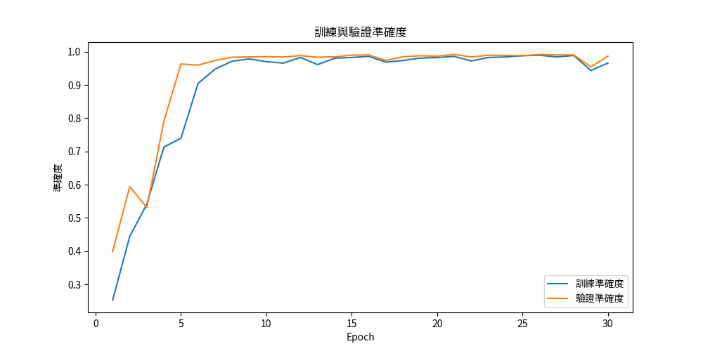
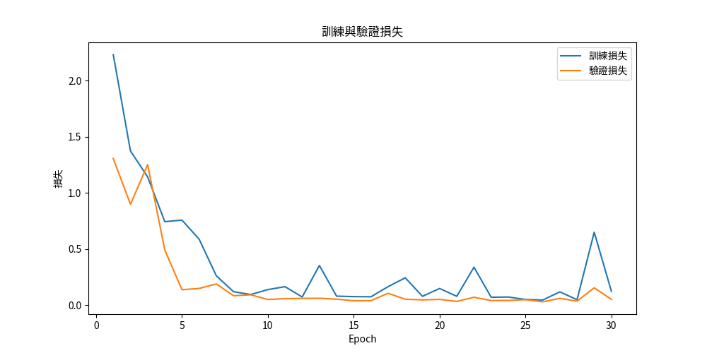
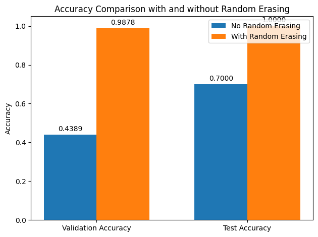

# 影像分類模型訓練與展示系統

## 專案概述
本專案實現了兩個影像分類模型的訓練與展示：
1. 使用 VGG16 with BN 進行 MNIST 手寫數字辨識
2. 使用 ResNet50 進行貓狗圖片分類

## 環境需求
- Python 3.9
- PyTorch 2.1.0
- OpenCV 4.10.0.84
- PyQt5 5.15.11
- Matplotlib 3.7.3
- Torchvision 0.16.0
- Torchsummary 1.5.1

## 專案結構

project_root/
│
├── main.py # 主程式進入點
├── ui/
│ ├── main_window.py # 主視窗類別
│ ├── accuracy.png # VGG16 訓練準確度圖表
│ └── loss.png # VGG16 訓練損失圖表
│
├── colab_train/ # VGG16 模型訓練程式碼
├── colab_train2/ # ResNet50 模型訓練程式碼
│
└── resources/ # 資源檔案夾
├── com.png # ResNet50 模型比較圖表
└── models/ # 模型權重檔案


## 模型訓練結果

### 1. VGG16 with BN (MNIST)
#### 訓練過程

*圖 1: VGG16 模型訓練與驗證準確度*


*圖 2: VGG16 模型訓練與驗證損失*

### 2. ResNet50 (貓狗分類)
#### 模型比較

*圖 3: 使用/不使用 Random Erasing 的 ResNet50 模型準確度比較*

## 功能說明

### 1. VGG16 MNIST 分類器
- **顯示模型架構**: 使用 torchsummary 顯示完整的網路架構
- **顯示訓練結果**: 展示訓練過程中的準確度和損失變化
- **圖片預測**: 支援上傳圖片進行數字辨識，並顯示預測結果和機率分布

### 2. ResNet50 貓狗分類器
- **顯示測試圖片**: 展示測試集中的貓狗圖片
- **顯示模型架構**: 顯示 ResNet50 的網路架構
- **比較模型效能**: 展示有無使用 Random Erasing 的效能差異
- **圖片預測**: 支援上傳圖片進行貓狗分類

## 使用說明

1. 安裝所需套件：

```
bash
pip install -r requirements.txt
```


3. 使用界面：
   - 點擊相應按鈕執行不同功能
   - 依照提示上傳圖片或查看結果

## 訓練細節

### VGG16 訓練 (colab_train)
- 資料集：MNIST
- 圖片尺寸：32x32
- 訓練週期：30 epochs
- 優化器：Adam
- 損失函數：CrossEntropyLoss
- 批次正規化：使用於每個卷積層後

### ResNet50 訓練 (colab_train2)
- 資料集：貓狗圖片集
- 圖片尺寸：224x224x3
- 資料增強：
  - 基礎版本：標準資料增強
  - 進階版本：加入 Random Erasing
- 遷移學習：使用預訓練權重
- 輸出層：2 節點 (貓/狗) + Softmax

## 實作重點
1. 使用 PyQt5 建立直觀的圖形介面
2. 實現即時圖片預測功能
3. 整合多個深度學習模型
4. 提供完整的訓練過程視覺化
5. 支援模型比較和效能分析

## 注意事項
- 執行前請確保已安裝所有必要套件
- 模型檔案較大，請確保足夠的硬碟空間
- 圖片預測時請使用符合格式的圖片檔案

## 作者
[您的姓名]

## 授權
本專案僅供教育用途使用。